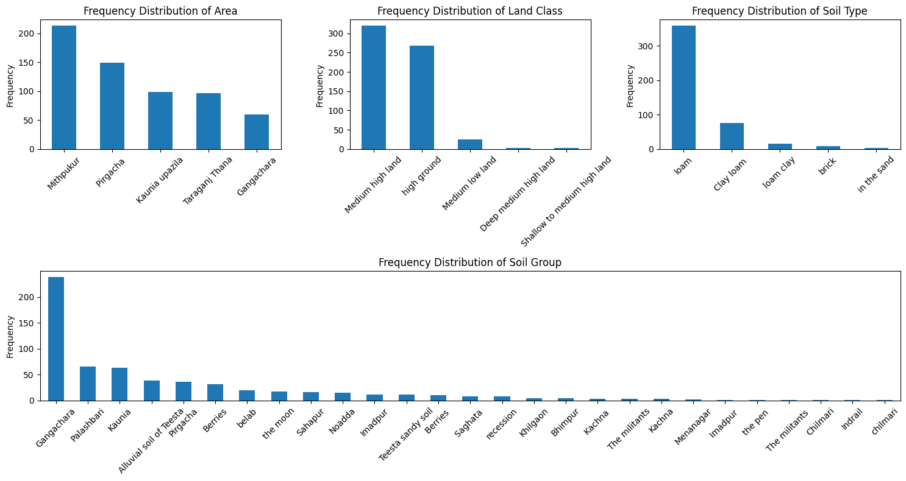
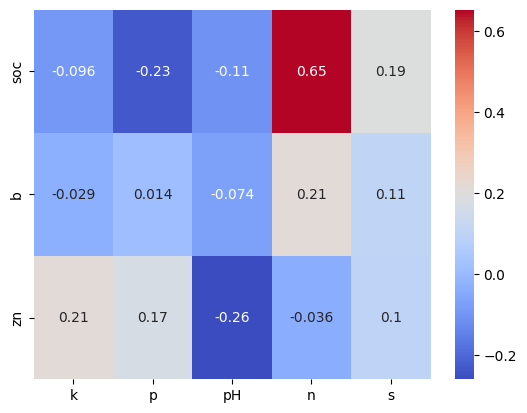
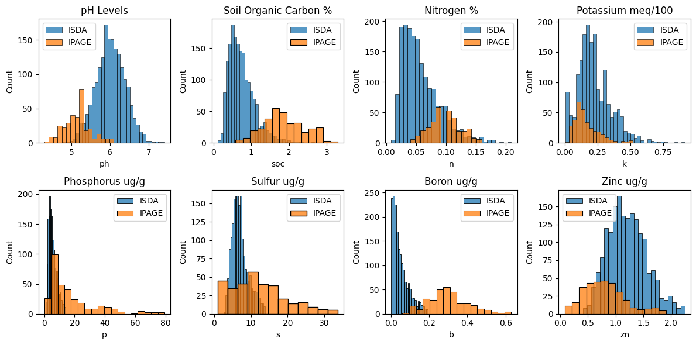

# EDA Findings

## Problems in Data
### Numerical Feature Issues

The dataset contains several anomalies in numerical features that may affect analysis:

- Invalid Numeric Formats:
    - 0.044
    - 13..8
    - .0.01
    - 0.0.1
- String Entries: A very low occurrence of string values in numeric columns.

## Range of Soil Nutrients

| Soil Nutrients | Range |
| --- | --- |
pH Levels  | 4.3 - 6.1
Soil Organic Carbon | 0.58 - 3.3
Nitrogen | 0.04 - 0.16
Potassium | 0.0 < 0.01 - 0.52
Phosphorus | 0.06 - 80.0
Sulfur | 1.0 - 33.7
Boron | 0.06 - 0.63
Zinc | 0.08 - 1.91

## Distribution Analysis of Categorical Features
The analysis of categorical features indicates an imbalanced distribution of data, which could impact model training and generalization. 

## Soil Nutrient Levels by Soil Type and Land Class
There are observable variations in soil nutrient levels depending on land_class and soil_type. However, due to the imbalanced data in categorical features, it may be premature to draw strong conclusions about causality.
### Feature Columns

### Target Columns

## Correlation between Soil Nutrients and Target
The correlation analysis highlights relationships between soil nutrients and target variables, supported by findings from relevant literature:

**"Prediction of Soil Reaction (PH) and Soil Nutrients Using Multivariate Statistics Techniques For Agricultural Crop and Soil Management"**:
- K and SOC show a positive correlation with PH.
- N displays a negative correlation with PH.
- Cu negatively correlates with PH, while Mn, Zn, Fe, and S correlate positively with PH.

**"Meta Analysis on The Effects of Types and Levels of N, P, K Fertilization"**:
- SOC levels are highest with balanced NPK and decline at very high NPK levels.

**"Effect of Boron, Zinc, and Sulphur on Soil Fertility and Yield of Fababean"**:
- Organic carbon levels improved slightly with the application of B, Zn, and S.
- Nitrogen levels increased with Zn and S additions.
- Available phosphorus improved with B but decreased with higher Zn and S levels.
- Potassium content decreased with B and Zn but increased with S application.

Some findings from these studies are not yet observable in the current IPAGE dataset, likely due to the limited data available at this time.

### Recommendations for Feature Engineering
Given the correlation observed between certain soil nutrients and target variables, consider combining features during the feature engineering phase. This may enhance the predictive power of models by leveraging the relationships identified in the analysis.

## Open Source Data

### ISDA

|nutrient | IPAGE UNITS | ISDA UNITS |
| --- | --- | --- |
|SOC | % (g/100g) | g/kg |
|ph |  | |
|Nitrogen | % (g/100g) | g/kg |
|Potassium | meq/100 (cmol/kg) | mg/kg |
|Phosphorus | µg/g | mg/kg |
|Sulfur | µg/g | mg/kg |
|Boron | µg/g | mg/kg |
|Zinc | µg/g | mg/kg |

$$\frac{meq}{100} = \frac{cmol}{kg}$$

Multiply mol/kg by the atomic weight of potassium to convert to mg/kg.

$$\frac{cmol}{kg} \cdot \frac{1mol}{100cmol} \cdot 39.1 \frac{g}{mol} => 1 \frac{g}{mol} = \frac{39.1}{100} \frac{g}{kg}$$

Converting Potassium mg/kg to $\frac{meq}{100}$ 
$$
\large
\frac{mg}{kg} \cdot 
\frac{g}{1000mg} \cdot
\frac{\frac{meq}{100}}{\frac{39.1}{100} \frac{g}{kg}}
$$

